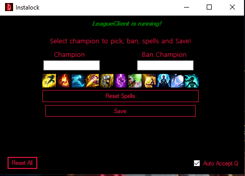

# Instalock - AutoAccept - AutoBan - Auto Pick Spells

Instalock is an application written in C# that automates League of Legends Client's actions!

##  Features

- **Queue Instalock:** Auto-Accepts Queue as soon as it pops up.
- **Champion Lock:** Insta-locks desired champion as soon as it's pickable.
- **Auto Ban** Auto-bans desired champion as soon as ban-phase starts.
- **Spell Picker** Auto-picks spells selected by user.
- **Unbannable:** It utilizes Riot Client API, calling endpoints that Client itself uses, making it unbannable.

## Open Source

Instalock is open-source (Form1.cs), you can learn both C# & how LeagueClient works behind the scenes. More features soon to come. Written by Bogdan!

## Usage
You can download compiled version by clicking on Releases (Instalock V1.1) and downloading it!

